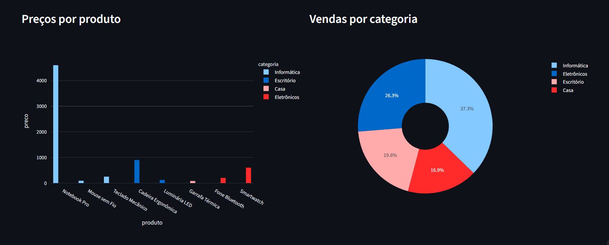

# Dashboard de preços e produtos

Dashboard interativo desenvolvido para praticar análise de dados, visualização
e construção de interfaces com Python.

## Problema

Uma base simples de produtos pode esconder informações importantes: quais
categorias vendem mais, qual é a faixa de preços praticada e qual produto tem o
maior impacto no faturamento. Este projeto transforma um CSV em uma visão
explorável para apoiar essa leitura.

## Funcionalidades

- carregamento e validação de dados em CSV;
- limpeza de preços, quantidades e datas;
- filtro por categoria;
- filtro por faixa de preço;
- indicadores de preço médio, mínimo, máximo e ticket médio;
- total de itens vendidos e categoria líder;
- tabela de produtos;
- gráfico de preços por produto;
- gráfico de vendas por categoria;
- testes automatizados das regras de análise.

## Tecnologias

- Python 3.11+
- Pandas
- Plotly
- Streamlit
- Pytest

## Como executar

```bash
python -m venv .venv
.\.venv\Scripts\activate
pip install -r requirements.txt
streamlit run app.py
```

Depois, abra `http://localhost:8501`.

## Como executar os testes

```bash
pytest -q
```

## Estrutura

```text
app.py                    # interface Streamlit
data/products.csv         # base de demonstração
src/data_loader.py        # carregamento e limpeza
src/analysis.py           # filtros e indicadores
tests/test_analysis.py    # testes unitários
docs/images/              # evidências visuais
```

## Exemplo de análise

Ao selecionar uma categoria e ajustar a faixa de preço, os indicadores e os
gráficos são recalculados para o recorte escolhido. Isso permite comparar, por
exemplo, o volume vendido em Informática com o de Escritório sem alterar a base
original.

## Demonstração

Aplicação publicada:

https://dashboard-precos-rantech.streamlit.app/



## Aprendizados

O projeto exercita o fluxo completo de uma análise pequena: carregar, validar,
limpar, transformar, resumir e apresentar dados. Também reforça a separação
entre regra de negócio e interface, o que facilita os testes e a evolução da
aplicação.
